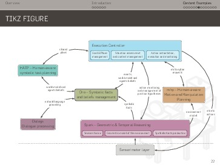

HRI Beamer Theme
================

A nice looking Beamer theme, based on HSRM Beamer theme by
[Benjamin Weiss](mailto:Benjamin.Weiss@kreatiefton.de), with a
few improvements like full-screen pictures and videos. [Download the
pre-compiled demo presentation](https://github.com/severin-lemaignan/hri-beamer-theme/blob/master/presentation.pdf?raw=true).





To compile, simply run `make`. This Beamer theme requires `lualatex` for
compilation (available in the `TeXlive` distribution for example).

It also looks nicer if the Flama font is installed in your system. Download it from here: 
- [Flama Light](http://fontpark.net/en/font/flamalight)
- [Flama Book](http://fontpark.net/en/font/flamabook)
- [Flama Medium](http://fontpark.net/en/font/flamamedium)

Special commands in this theme
------------------------------

### Full-screen pictures


```latex
\imageframe[color=...,caption=...,scale=...]{mypic.jpg}
```

Note that the picture's aspect ratio is respected.

- `color`: colour of the background. Defaults to `white`.
- `caption`: caption that will be displayed as an overlay on top of the picture
- `scale`: a scaling factor (useful to add a small margin around the picture for
  instance). Defaults to 1.0.

**Due to the inner working o TikZ, you may have to compile your presentation
twice to get the background image to appear!**

Alternatively, you can use this syntax to set a background image for any slide:

```latex
{\fullbackground[options]{mypic.jpg}

\begin{frame}
%...
\end{frame}
}
```

(the same options as for `imageframe` are available)

or the shortcut:

```latex
\bgframe[mypic.jpg]{

%...

}
```

### Videos

```latex
\video[aspect ratio]{width}{myvideo.webm}
```

This integrates a video in your presentation (attention: the video file
*itself* is not embedded in the PDF: you need to take it along with your PDF).
Clicking on it opens the default system video player for the given video format
(using `pdfpc`, you can also play the video directly inside your presentation,
cf below).

- `aspect ratio` is a real value equal to height/width, defaults to 16:9 (ie,
  0.56).
- `width` is any valid Beamer length (like `0.7\textwidth` for instance)

A preview picture (typically, the first frame of the video) is used if a file
called `myvideo_thumb.jpg` is found. Assuming `avconv` is available on your
system, `make thumbs` will generate such a preview picture for you.

Note that, if played with [pdfpc](https://github.com/severin-lemaignan/pdfpc),
the video will be nicely overlaid on top of the slide, exactly covering the
video preview. `pdfpc` also support special extended URI for the video file,
allowing to define options like start and stop times (in seconds from the
beginning), looping, auto-start and mute (no audio). For instance:

```latex
\video[aspect ratio]{width}{myvideo.webm?start=20&stop=34&autostart&noaudio&loop}
```

`make thumbs` will also use the start time, if specified, to generate a
thumbnail of the video at the correct time.


You can also produce a full-screen video frame with:

```latex
\videoframe[aspect ratio]{myvideo.webm}
```

`aspect ratio` defaults to 4:3 (ie, fullscreen on Beamer). Set it to 0.56
(=9/16) for 16:9 for instance.

### Bibliography references

You can insert references to specific paper in the footer of a slide that way:

```latex
{
  \paper{Superman, How Kripton changed my life, Springer 2014}
  \begin{frame}
  ...
  \end{frame}
}
```

### CreativeCommons License

Adding:

```latex
\licenseframe{<source url>}
```

creates a frame with a CreateCommons BY-SA license explanation and a link to
download the source.

### Source code

The nice [minted](https://www.ctan.org/tex-archive/macros/latex/contrib/minted)
package is provided (and pre-configured for C++, Python, `sh` and XML) so that
rendering beautiful syntax-highlighted code is a breeze:

```latex
\begin{pythoncode}

def print_hello():
    print("Hello World!")


if __name__ == "__main__":
    print_hello()
\end{pythoncode}

```

Note that this requires `pygmentize` to be installed on your machine (`sudo
apt-get install python-pygments`)

### Badges

We can use the `\badge` command inside a frame to display a small (2cmx2cm)
picture in the top right corner of the slide:

```latex
\badge{<image>}
```

Reference and License
---------------------

Based on HSRM Beamer theme by [Benjamin.Weiss@kreatiefton.de](mailto:Benjamin.Weiss@kreatiefton.de)

Made available under the [Creative Commons BY-SA](http://creativecommons.org/licenses/by-sa/4.0/) license.

